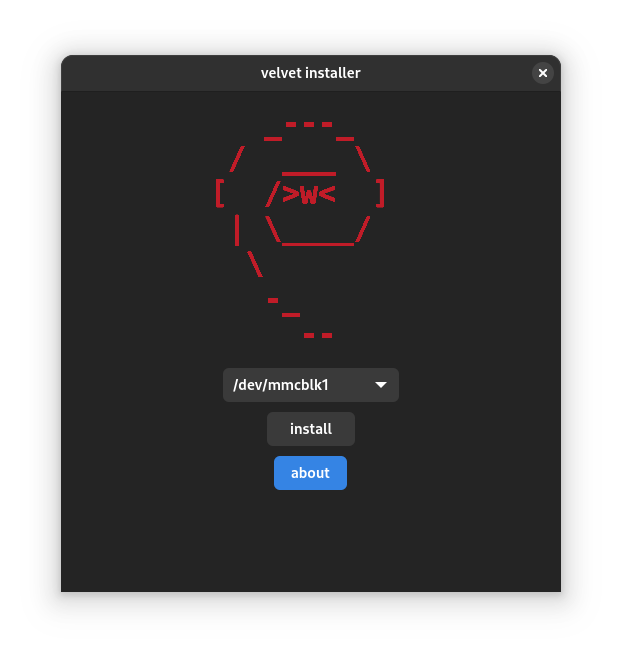

# Velvet Installer (wip)

_Disclaimer. this software is still work in progress and currently doesn't implement even half the intended functionality. It's currently not meant for use, only development._



_this is just a preview and subject to change_

graphical installer for [velvet os](https://github.com/hexdump0815/imagebuilder) meant **only** for arm64 chromebooks

it's meant to automate and ease the process of [regular](https://github.com/hexdump0815/imagebuilder/blob/main/doc/chromebooks/installation/basic-installation.md) and (maybe later) [luks](https://github.com/hexdump0815/imagebuilder/blob/main/doc/chromebooks/installation/luks-installation.md) installation

making it nicer and simpler to perform for less technical users

written in gtk4 and c++ with ❤️


I'd really want for this project to interface with software as natively as possible

while stuff like cgpt is fine to integrate with (bsd 3), make files make it hard to use

at the same time i don't want to relicense project to GPL because ```findmnt``` or ```rsync```